# ☁️ Scalable Cloud-Native Architecture for Fibonacci Project Dashboard

## 🎯 **Design Goals**
- **100x Scalable**: Handle massive data growth and user load
- **Git Integrated**: Full version control and CI/CD workflows  
- **Cloud Native**: Leverage cloud services for reliability and performance
- **API First**: Decoupled architecture with REST APIs
- **Global Fast**: CDN delivery for worldwide access

## 🏗️ **Architecture Overview**

```mermaid
graph TB
    A[Communication Files] --> B[Google Apps Script]
    B --> C[Knowledge Base Processor]
    C --> D[Google Cloud Storage API]
    D --> E[CDN Global Cache]
    E --> F[Static Dashboard Site]
    F --> G[Global Users]
    
    H[GitHub Repository] --> I[CI/CD Pipeline]
    I --> J[Vercel/Netlify Deploy]
    J --> F
    
    K[Google Sheets] --> B
    L[Real-time Updates] --> D
```



## 🔧 **Technical Stack**

### **Data Processing Layer**
- **Google Apps Script**: Communication parsing and processing
- **Google Sheets**: Configuration and insights storage
- **Scheduled Triggers**: Automated data refresh

### **API & Storage Layer** 
- **Google Cloud Storage**: JSON API endpoints with CORS
- **Cloud Functions**: Optional serverless API processing
- **Firebase Realtime DB**: Optional real-time updates

### **Frontend & Delivery**
- **Static Site Generator**: Vite/Next.js for optimized builds
- **GitHub Repository**: Version control and collaboration
- **Vercel/Netlify**: Automated deployments with CDN
- **Global CDN**: Sub-100ms response times worldwide

### **Monitoring & Analytics**
- **Google Analytics**: User behavior tracking
- **Cloud Monitoring**: API performance and uptime
- **Error Tracking**: Sentry for error monitoring

## 📊 **Data Flow Architecture**

### **1. Data Ingestion**
```javascript
// Google Apps Script - Enhanced for API Publishing
class ScalableKnowledgeBuilder {
  async publishToCloudAPI(knowledgeBase) {
    // Publish to multiple endpoints for redundancy
    const endpoints = [
      'https://storage.googleapis.com/fibonacci-kb/api/v1/knowledge-base.json',
      'https://fibonacci-api.vercel.app/api/knowledge-base',
      'https://script.google.com/macros/s/SCRIPT_ID/exec?action=update'
    ];
    
    const publishPromises = endpoints.map(endpoint => 
      this.publishToEndpoint(endpoint, knowledgeBase)
    );
    
    await Promise.allSettled(publishPromises);
  }
  
  async publishToEndpoint(endpoint, data) {
    return UrlFetchApp.fetch(endpoint, {
      method: 'PUT',
      headers: {
        'Content-Type': 'application/json',
        'Authorization': 'Bearer ' + this.getApiKey()
      },
      payload: JSON.stringify({
        data: data,
        timestamp: new Date().toISOString(),
        version: this.getVersion()
      })
    });
  }
}
```

### **2. API Endpoints**
```javascript
// Cloud Function or Vercel API Route
export default async function handler(req, res) {
  // CORS headers for global access
  res.setHeader('Access-Control-Allow-Origin', '*');
  res.setHeader('Access-Control-Allow-Methods', 'GET, POST, PUT');
  res.setHeader('Cache-Control', 's-maxage=300, stale-while-revalidate=600');
  
  switch (req.method) {
    case 'GET':
      return getKnowledgeBase(req, res);
    case 'PUT':
      return updateKnowledgeBase(req, res);
    default:
      return res.status(405).json({ error: 'Method not allowed' });
  }
}

async function getKnowledgeBase(req, res) {
  try {
    // Get from Google Cloud Storage or Firebase
    const knowledgeBase = await fetchFromCloudStorage();
    
    // Optional: Filter or paginate data based on query params
    const filtered = filterKnowledgeBase(knowledgeBase, req.query);
    
    return res.status(200).json({
      success: true,
      data: filtered,
      lastUpdated: knowledgeBase.metadata.lastUpdated,
      version: knowledgeBase.metadata.version
    });
  } catch (error) {
    return res.status(500).json({ error: 'Failed to fetch knowledge base' });
  }
}
```

### **3. Frontend Data Loading**
```javascript
// Dashboard - Optimized Data Loading
class KnowledgeBaseClient {
  constructor() {
    this.baseUrl = 'https://api.fibonacci-project.com';
    this.cache = new Map();
    this.version = null;
  }
  
  async loadKnowledgeBase(options = {}) {
    try {
      // Check cache first
      if (this.cache.has('knowledge-base') && !options.forceRefresh) {
        return this.cache.get('knowledge-base');
      }
      
      // Fetch with retry logic
      const response = await this.fetchWithRetry('/api/v1/knowledge-base');
      const result = await response.json();
      
      if (result.success) {
        // Cache the result
        this.cache.set('knowledge-base', result.data);
        this.version = result.version;
        
        // Set up real-time updates if version changes
        this.setupRealTimeUpdates();
        
        return result.data;
      }
      
      throw new Error(result.error || 'Failed to load knowledge base');
      
    } catch (error) {
      console.error('Knowledge base loading failed:', error);
      // Return cached data as fallback
      return this.cache.get('knowledge-base') || this.getEmptyKnowledgeBase();
    }
  }
  
  async fetchWithRetry(endpoint, retries = 3) {
    for (let i = 0; i < retries; i++) {
      try {
        const response = await fetch(this.baseUrl + endpoint);
        if (response.ok) return response;
        throw new Error(`HTTP ${response.status}`);
      } catch (error) {
        if (i === retries - 1) throw error;
        await new Promise(resolve => setTimeout(resolve, 1000 * (i + 1)));
      }
    }
  }
  
  setupRealTimeUpdates() {
    // Optional: WebSocket or Server-Sent Events for real-time updates
    const eventSource = new EventSource(`${this.baseUrl}/api/v1/updates`);
    eventSource.onmessage = (event) => {
      const update = JSON.parse(event.data);
      if (update.version !== this.version) {
        this.loadKnowledgeBase({ forceRefresh: true });
      }
    };
  }
}
```

## 🚀 **Deployment Strategy**

### **Repository Structure**
```
📁 fibonacci-project-dashboard/
├── 📁 .github/
│   └── 📁 workflows/
│       ├── deploy.yml           # CI/CD pipeline
│       └── test.yml             # Automated testing
├── 📁 src/
│   ├── 📁 dashboard/            # Frontend React/Vue/Vanilla
│   │   ├── 📁 components/
│   │   ├── 📁 services/         # API clients
│   │   └── 📄 main.js
│   ├── 📁 api/                  # Serverless functions
│   │   ├── 📄 knowledge-base.js
│   │   └── 📄 health.js
│   └── 📁 google-apps-script/   # Processing logic
├── 📁 public/                   # Static assets
├── 📁 dist/                     # Build output
├── 📄 package.json
├── 📄 vite.config.js            # Build configuration
├── 📄 vercel.json               # Deployment config
└── 📄 README.md
```

### **CI/CD Pipeline** (`.github/workflows/deploy.yml`)
```yaml
name: Deploy Fibonacci Dashboard

on:
  push:
    branches: [main]
  pull_request:
    branches: [main]

jobs:
  test:
    runs-on: ubuntu-latest
    steps:
      - uses: actions/checkout@v3
      - uses: actions/setup-node@v3
        with:
          node-version: '18'
          cache: 'npm'
      
      - run: npm ci
      - run: npm run test
      - run: npm run lint
      - run: npm run build

  deploy:
    needs: test
    runs-on: ubuntu-latest
    if: github.ref == 'refs/heads/main'
    steps:
      - uses: actions/checkout@v3
      - uses: actions/setup-node@v3
        with:
          node-version: '18'
          cache: 'npm'
      
      - run: npm ci
      - run: npm run build
      
      - name: Deploy to Vercel
        uses: amondnet/vercel-action@v20
        with:
          vercel-token: ${{ secrets.VERCEL_TOKEN }}
          vercel-org-id: ${{ secrets.ORG_ID }}
          vercel-project-id: ${{ secrets.PROJECT_ID }}
          working-directory: ./
```

## 📈 **Scaling Considerations**

### **Performance Optimizations**
- **Code Splitting**: Load dashboard modules on demand
- **Image Optimization**: WebP/AVIF with responsive sizing
- **Bundle Analysis**: Monitor and optimize bundle sizes
- **Service Worker**: Offline capability and background sync

### **Data Management**
- **Pagination**: Handle large datasets efficiently
- **Incremental Updates**: Only sync changed data
- **Data Compression**: Gzip/Brotli for API responses
- **Database Indexing**: Optimize query performance

### **Monitoring & Observability**
```javascript
// Error Tracking and Performance Monitoring
import * as Sentry from '@sentry/browser';
import { getCLS, getFID, getFCP, getLCP, getTTFB } from 'web-vitals';

// Initialize error tracking
Sentry.init({
  dsn: 'YOUR_SENTRY_DSN',
  environment: process.env.NODE_ENV
});

// Track Core Web Vitals
function sendToAnalytics(metric) {
  gtag('event', metric.name, {
    value: Math.round(metric.name === 'CLS' ? metric.value * 1000 : metric.value),
    event_category: 'Web Vitals',
    event_label: metric.id,
    non_interaction: true
  });
}

getCLS(sendToAnalytics);
getFID(sendToAnalytics);
getFCP(sendToAnalytics);
getLCP(sendToAnalytics);
getTTFB(sendToAnalytics);
```

## 🔒 **Security & Compliance**

### **API Security**
- **Rate Limiting**: Prevent API abuse
- **CORS Configuration**: Secure cross-origin requests  
- **Authentication**: API keys for write operations
- **Input Validation**: Sanitize all inputs

### **Data Privacy**
- **PII Scrubbing**: Remove sensitive information
- **Access Controls**: Role-based permissions
- **Audit Logging**: Track all data access
- **GDPR Compliance**: Data retention policies

## 🎯 **Implementation Roadmap**

### **Phase 1: Foundation** (Week 1)
- [ ] Set up GitHub repository with proper structure
- [ ] Create basic API endpoints (Vercel functions)
- [ ] Implement Google Cloud Storage integration
- [ ] Set up CI/CD pipeline

### **Phase 2: Core Features** (Week 2)
- [ ] Migrate dashboard to consume API
- [ ] Implement caching and performance optimizations
- [ ] Add real-time update capability
- [ ] Set up monitoring and error tracking

### **Phase 3: Scale & Polish** (Week 3)
- [ ] Load testing and optimization
- [ ] Advanced filtering and search
- [ ] Mobile-responsive design
- [ ] Documentation and team onboarding

This architecture provides a solid foundation that can scale to handle massive data growth while maintaining fast performance and enabling proper development workflows with Git integration.
